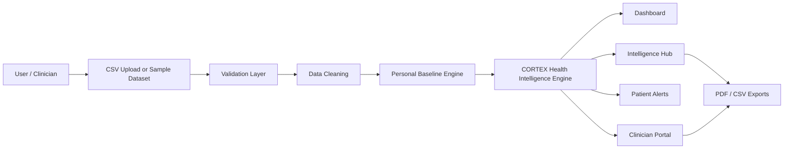
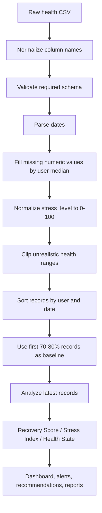

# CORTEX - Personalized Health Intelligence

CORTEX is a working health-intelligence MVP that converts wearable-style health data into personalized recovery, stress, sleep, anomaly, and clinician-review insights. The prototype is built with Streamlit and Python, and is designed around a modern clinical dashboard experience inspired by the provided Stitch prototype screens.

## Working Links

- GitHub repository: [https://github.com/Shalinijha0701/CORTEX](https://github.com/Shalinijha0701/CORTEX)
- Local app link after running the project: [http://localhost:8501](http://localhost:8501)
- Prototype screen recording: [Google Drive demo video](https://drive.google.com/file/d/146NRshMjqcuD72kZ9YU8R04TQ-YnCXZQ/view?usp=sharing)
- Streamlit Cloud deployment settings:
  - Repository: `Shalinijha0701/CORTEX`
  - Branch: `main`
  - Main file path: `app.py`

> Public live link note: Streamlit/Render deployment requires the project owner to authorize the GitHub repository from their own account. Once deployed, paste that public URL in this section.

## Problem Statement

Wearables collect useful signals such as heart rate, HRV, sleep, steps, SpO2, stress level, and body temperature. Most dashboards show these values as generic charts, but they do not deeply compare a user's current condition against the user's own normal baseline.

CORTEX addresses this by building a personal baseline for each user and then generating understandable insights:

- Is recovery strong or weak today?
- Is stress increasing?
- Is HRV below the user's normal range?
- Is sleep quality affecting recovery?
- Does the latest record need clinician review?

## Solution Overview

CORTEX lets a user upload a CSV file or use the built-in sample dataset. The system validates the data, cleans missing values, normalizes stress scale, builds a personal baseline, computes health intelligence scores, and presents the result in a multi-page dashboard.

The MVP includes:

- CSV upload and validation workflow
- Personal baseline creation
- Recovery score
- Stress index and stress trend
- Sleep quality classification
- Anomaly alerts
- Health state classification
- Confidence score
- Patient alert center
- Clinician review portal
- PDF health report export
- Baseline CSV export
- Enriched CSV export

## Application Pages

| Page | Purpose |
| --- | --- |
| Dashboard | Main patient dashboard with recovery gauge, HRV/stress/sleep/resting-HR cards, and trend charts |
| Intelligence Hub | Anomaly alerts, recommendations, baseline comparison, model metrics, and report export |
| Data Upload Validation | File intake, schema check, missing-value check, outlier detection, stress normalization, and baseline readiness |
| Profile & Baseline | User-specific baseline statistics and latest-vs-baseline deltas |
| Patient Alerts | Prototype patient-facing alert and notification workflow |
| Clinician Portal | Multi-patient queue, critical recovery count, selected-patient summary, notes, and PDF export |

## Architecture



## Data Flow



## Health Intelligence Logic

### Personal Baseline

For each selected user, CORTEX calculates baseline means and standard deviations for:

- Heart rate
- Resting heart rate
- HRV
- Sleep hours
- Sleep score
- Steps
- Active minutes
- Calories burned
- SpO2
- Respiratory rate
- Stress level
- Body temperature

The app uses the user's earlier time-ordered records as the personal baseline and compares the latest records against that baseline.

### Recovery Score

The recovery score is a 0-100 score calculated from:

- Sleep duration and sleep score
- HRV compared with baseline
- Activity balance compared with baseline
- SpO2
- Stress level
- Resting heart rate penalty
- Body temperature penalty

### Stress Index

The stress index is calculated from:

- Reported stress level
- Heart rate elevation
- HRV drop
- Sleep reduction

The app also calculates a stress trend by comparing short-term and longer-term rolling averages.

### Health State

CORTEX classifies the latest user state into:

- `Normal`
- `Stressed`
- `Fatigued`
- `Recovery Needed`

It also provides a confidence score so the prototype feels more like an intelligence system and less like a plain rule checker.

## Dataset

The included sample dataset is `sample_health_data.csv`.

- Rows: 1,500
- Users: 20
- Days per user: 75
- Target labels: `Normal`, `Stressed`, `Fatigued`, `Recovery Needed`

Required CSV column groups:

- Identity: `user_id`, `date`
- Vitals: `heart_rate`, `resting_heart_rate`, `hrv`, `spo2`, `respiratory_rate`, `body_temperature`
- Sleep and stress: `sleep_hours`, `sleep_score`, `stress_level`
- Activity: `steps`, `active_minutes`, `calories_burned`

Optional target columns for training/evaluation:

```text
recovery_score,health_state
```

## External New-User Testing

The final curated submission includes a second-type external test package generated separately from the internal sample dataset.

External test summary:

- Rows: 90
- Users: 3 unseen users
- User IDs: `TEST_U01`, `TEST_U02`, `TEST_U03`
- Date range: 2025-06-01 to 2025-06-30
- Health-state distribution:
  - Normal: 38
  - Fatigued: 20
  - Stressed: 18
  - Recovery Needed: 14

External test files:

- `external_test_features_only.csv`
- `external_test_labels.csv`
- `external_test_data.csv`
- `test_predictions.csv`
- `dataset_manifest.json`
- `README_external_test.md`

External test result using the saved demonstration model artifacts:

- Recovery-score MAE: `11.462`
- Health-state accuracy: `0.667`

These metrics validate the prototype's external testing workflow on unseen synthetic users. They are not clinical accuracy claims.

## Tech Stack

- Python
- Streamlit
- Pandas
- NumPy
- Plotly
- Scikit-learn
- ReportLab

## Folder Structure

```text
CORTEX/
├── app.py
├── components.py
├── styles.py
├── model.py
├── utils.py
├── reporting.py
├── generate_sample_data.py
├── train_model.py
├── run_smoke_tests.py
├── sample_health_data.csv
├── requirements.txt
├── pages/
│   ├── dashboard.py
│   ├── intelligence_hub.py
│   ├── data_upload.py
│   ├── profile_baseline.py
│   ├── mobile_alerts.py
│   └── clinician_portal.py
├── model_artifacts/
│   ├── health_state_classifier.joblib
│   ├── recovery_regressor.joblib
│   └── training_metrics.json
├── documentation/
│   ├── Technical_Documentation.md
│   ├── Technical_Documentation.pdf
│   └── Architecture_Diagram.png
├── presentation/
│   └── CORTEX_Personalized_Health_Intelligence.pptx
├── supporting_materials/
├── demo_video/
├── Dockerfile
├── Procfile
├── render.yaml
└── runtime.txt
```

## Run Locally

```powershell
python -m venv .venv
.venv\Scripts\Activate.ps1
pip install -r requirements.txt
streamlit run app.py --server.port 8501
```

Open:

```text
http://localhost:8501
```

## Test

```powershell
python run_smoke_tests.py
python train_model.py
```

Current training output:

- Recovery score MAE: about `2.917`
- Health-state accuracy: about `0.977`

Metrics are saved in:

```text
model_artifacts/training_metrics.json
```

## Deployment

### Streamlit Community Cloud

Use these settings:

```text
Repository: Shalinijha0701/CORTEX
Branch: main
Main file path: app.py
```

### Render

This repository includes `render.yaml`.

Render settings:

```text
Build command: pip install -r requirements.txt
Start command: streamlit run app.py --server.port $PORT --server.address 0.0.0.0
```

### Docker

```powershell
docker build -t cortex-health .
docker run -p 8501:8501 cortex-health
```

## Prototype Demo Flow

1. Open the dashboard.
2. Select a user profile.
3. Review recovery score, health state, confidence, HRV delta, stress, sleep, and resting HR.
4. Open Data Upload Validation and show validation checks.
5. Open Intelligence Hub and show anomaly alerts and recommendations.
6. Download the PDF report.
7. Open Profile & Baseline and explain personal baseline logic.
8. Open Patient Alerts and Clinician Portal.
9. Show the multi-patient clinician queue and selected-patient export.

## Limitations

- This is a wellness intelligence prototype, not a medical diagnosis tool.
- The included dataset is synthetic/demo data.
- No real wearable API integration is included yet.
- No authentication or encrypted production database is included yet.
- Clinician notes are stored only in the active Streamlit session.

## Future Scope

- Fitbit, Garmin, Apple Health, or Google Fit integration
- Authentication and role-based patient/clinician access
- Secure database storage
- Mobile app notifications
- Longer time-series model training
- Doctor or coach dashboard
- Privacy-preserving health analytics

## Disclaimer

CORTEX is intended only as a prototype for personalized wellness insights. It is not a medical device and should not be used as a replacement for professional medical advice, diagnosis, or treatment.
